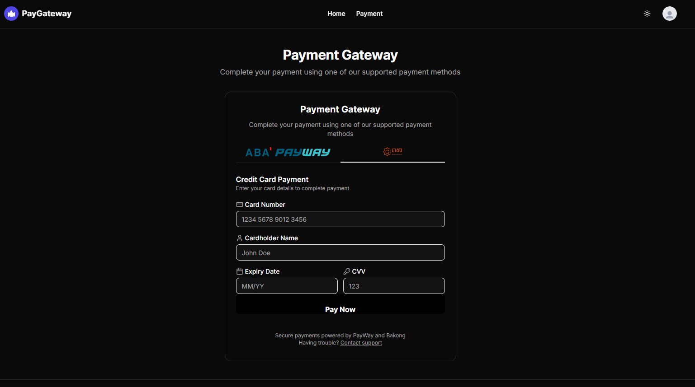
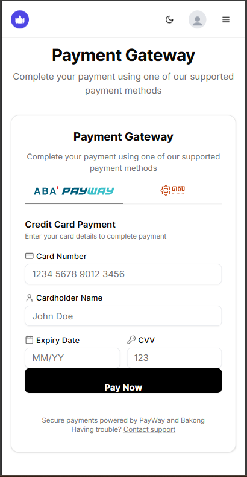
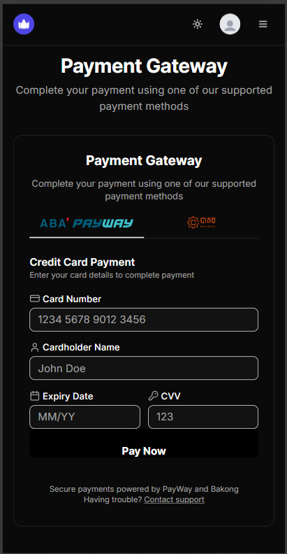

# Payment Gateway Integration

A modern, responsive payment gateway integration built with Next.js 15, featuring multiple payment methods including PayWay and Bakong. This project provides a seamless payment experience with a dark/light theme toggle, responsive design, and a professional UI.



## Features

- **Multiple Payment Methods**: PayWay and Bakong integration
- **Responsive Design**: Mobile-friendly interface that works across all devices
- **Theme Toggle**: Dark/light mode support
- **Modern UI**: Clean, professional design using Shadcn UI components
- **Form Validation**: Secure payment form with validation
- **Backend Integration**: API routes for payment processing
- **Vercel-style Footer**: Professional footer layout with responsive design

## Tech Stack

- **Frontend**: Next.js 15, React, TypeScript
- **Styling**: Tailwind CSS, Shadcn UI
- **State Management**: React Hooks
- **Payment Processing**: PayWay, Bakong APIs
- **Backend Storage**: Convex
- **Authentication**: (Optional setup included)

## Screenshots

### Light Mode


### Dark Mode


## Getting Started

### Prerequisites

- Node.js 18.17.0 or later
- npm, yarn, or pnpm package manager

### Installation

1. Clone the repository
```bash
git clone https://github.com/sisovin/integrating-payment-gateway.git
cd integrating-payment-gateway
```

2. Install dependencies
```bash
npm install
# or
yarn install
# or
pnpm install
```

3. Set up environment variables
Create a `.env.local` file in the root directory with the following variables:
```
NEXT_PUBLIC_PAYWAY_MERCHANT_ID=your_payway_merchant_id
NEXT_PUBLIC_PAYWAY_API_KEY=your_payway_api_key
NEXT_PUBLIC_BAKONG_API_KEY=your_bakong_api_key
CONVEX_DEPLOYMENT=your_convex_deployment_url
```

4. Start the development server
```bash
npm run dev
# or
yarn dev
# or
pnpm dev
```

5. Open [http://localhost:3000](http://localhost:3000) in your browser to see the application.

## Project Structure

```
integrating-payment-gateway/
├── app/
│   ├── api/
│   │   └── payments/
│   │       ├── bakong/
│   │       ├── payway/
│   │       └── status/
│   ├── dashboard/
│   └── payment/
├── components/
│   ├── payments/
│   │   ├── BakongButton.tsx
│   │   ├── PaymentForm.tsx
│   │   ├── PaymentFormContainer.tsx
│   │   └── PayWayButton.tsx
│   └── ui/
├── convex/
├── lib/
│   └── payments/
└── public/
```

## Setting Up Payment Providers

### PayWay Setup

1. Create an account at [PayWay](https://www.payway.com.kh/)
2. Generate API keys from the developer dashboard
3. Add the keys to your `.env.local` file
4. Configure the callback URLs in your PayWay merchant account:
   - Success URL: `https://yourdomain.com/api/payments/payway/callback`
   - Failure URL: `https://yourdomain.com/payment/failure`

### Bakong Setup

1. Register for a Bakong merchant account
2. Obtain API credentials
3. Add the credentials to your `.env.local` file
4. Set up the webhook URL in your Bakong dashboard:
   - Webhook URL: `https://yourdomain.com/api/payments/bakong/webhook`

## Convex Backend Integration

This project uses Convex for backend data storage. To set up Convex:

1. Create a Convex account at [https://www.convex.dev/](https://www.convex.dev/)
2. Create a new deployment
3. Copy the deployment URL to your `.env.local` file
4. Run the Convex development server:
```bash
npx convex dev
```

## Adding Custom Payment Methods

To add a new payment method:

1. Create a new button component in `components/payments/`
2. Add API routes in `app/api/payments/your-payment-method/`
3. Implement the payment processing logic in `lib/payments/your-payment-method.ts`
4. Update the `PaymentForm.tsx` component to include your new payment method

## Customization

### Styling

The project uses Tailwind CSS for styling. You can customize the theme in `tailwind.config.ts`:

```typescript
theme: {
  extend: {
    colors: {
      // Your custom colors
    },
  },
},
```

### Components

All UI components are built using Shadcn UI which are located in the `components/ui/` directory. You can customize them to match your brand.

## Deployment

The easiest way to deploy this application is to use [Vercel](https://vercel.com):

1. Push your code to a GitHub repository
2. Import the project into Vercel
3. Set up your environment variables
4. Deploy

For other deployment options, refer to the [Next.js deployment documentation](https://nextjs.org/docs/app/building-your-application/deploying).

## Contributing

Contributions are welcome! Please feel free to submit a Pull Request.

## License

This project is licensed under the MIT License - see the LICENSE file for details.

## Acknowledgements

- [Next.js](https://nextjs.org)
- [Shadcn UI](https://ui.shadcn.com)
- [Tailwind CSS](https://tailwindcss.com)
- [Convex](https://www.convex.dev)
- [PayWay](https://www.payway.com.kh)
- [Bakong](https://bakong.nbc.gov.kh)
